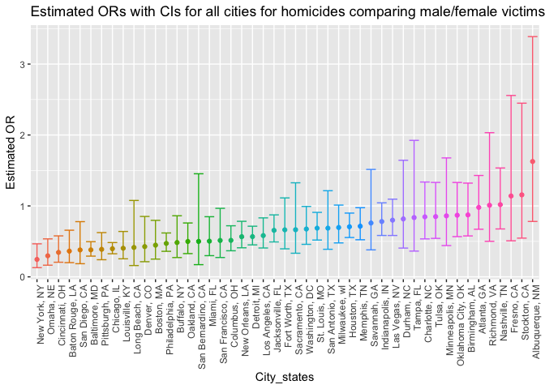
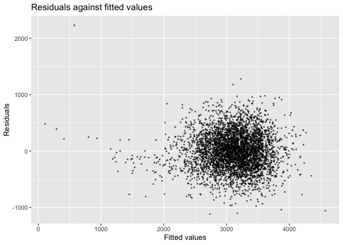

p8105_hw6_yc4016
================
Yishan Chen
2022-12-01

# Problem 2

``` r
homicide_df = 
  read_csv("./data/homicide-data.csv") %>% 
  mutate(city_state = str_c(city, state, sep = ", ", collapse = NULL),
         homicide_situation = as.numeric(disposition == "Closed by arrest")) %>% 
  filter(!(city_state %in% c("Dallas, TX", "Phoenix, AZ", "Kansas City, MO", "Tulsa, AL")),
         victim_race %in% c("White", "Black")) %>% 
  mutate (victim_age = as.numeric(victim_age),
          homicide_situation = as.numeric(homicide_situation))
```

    ## Rows: 52179 Columns: 12
    ## ── Column specification ────────────────────────────────────────────────────────
    ## Delimiter: ","
    ## chr (9): uid, victim_last, victim_first, victim_race, victim_age, victim_sex...
    ## dbl (3): reported_date, lat, lon
    ## 
    ## ℹ Use `spec()` to retrieve the full column specification for this data.
    ## ℹ Specify the column types or set `show_col_types = FALSE` to quiet this message.

    ## Warning in mask$eval_all_mutate(quo): NAs introduced by coercion

``` r
homicide_df
```

    ## # A tibble: 39,693 × 14
    ##    uid   repor…¹ victi…² victi…³ victi…⁴ victi…⁵ victi…⁶ city  state   lat   lon
    ##    <chr>   <dbl> <chr>   <chr>   <chr>     <dbl> <chr>   <chr> <chr> <dbl> <dbl>
    ##  1 Alb-…  2.01e7 SATTER… VIVIANA White        15 Female  Albu… NM     35.1 -107.
    ##  2 Alb-…  2.01e7 MULA    VIVIAN  White        72 Female  Albu… NM     35.1 -107.
    ##  3 Alb-…  2.01e7 BOOK    GERALD… White        91 Female  Albu… NM     35.2 -107.
    ##  4 Alb-…  2.01e7 MARTIN… GUSTAVO White        56 Male    Albu… NM     35.1 -107.
    ##  5 Alb-…  2.01e7 LUJAN   KEVIN   White        NA Male    Albu… NM     35.1 -107.
    ##  6 Alb-…  2.01e7 GRAY    STEFAN… White        43 Female  Albu… NM     35.1 -107.
    ##  7 Alb-…  2.01e7 DAVID   LARRY   White        52 Male    Albu… NM     NA     NA 
    ##  8 Alb-…  2.01e7 BRITO   ELIZAB… White        22 Female  Albu… NM     35.1 -107.
    ##  9 Alb-…  2.01e7 KING    TEVION  Black        15 Male    Albu… NM     35.1 -107.
    ## 10 Alb-…  2.01e7 BOYKIN  CEDRIC  Black        25 Male    Albu… NM     35.1 -107.
    ## # … with 39,683 more rows, 3 more variables: disposition <chr>,
    ## #   city_state <chr>, homicide_situation <dbl>, and abbreviated variable names
    ## #   ¹​reported_date, ²​victim_last, ³​victim_first, ⁴​victim_race, ⁵​victim_age,
    ## #   ⁶​victim_sex

``` r
fit_logistic_baltimore = 
  homicide_df %>% 
  filter(city_state == "Baltimore, MD") %>%
  glm(homicide_situation ~ victim_age + victim_sex + victim_age, data = ., family = binomial()) 

fit_logistic_baltimore
```

    ## 
    ## Call:  glm(formula = homicide_situation ~ victim_age + victim_sex + 
    ##     victim_age, family = binomial(), data = .)
    ## 
    ## Coefficients:
    ##    (Intercept)      victim_age  victim_sexMale  
    ##       0.384309       -0.004192       -0.966250  
    ## 
    ## Degrees of Freedom: 2752 Total (i.e. Null);  2750 Residual
    ## Null Deviance:       3568 
    ## Residual Deviance: 3516  AIC: 3522

``` r
fit_logistic_baltimore %>% 
  broom::tidy() %>% 
  mutate(OR = exp(estimate),
         lower_bound = exp(estimate - 1.96 * std.error),
         upper_bound = exp(estimate + 1.96 * std.error)) %>%
  select(term, estimate, OR, lower_bound, upper_bound) %>%
  filter(term == "victim_sexMale") %>% 
  knitr::kable(digits = 3)
```

| term           | estimate |    OR | lower_bound | upper_bound |
|:---------------|---------:|------:|------------:|------------:|
| victim_sexMale |   -0.966 | 0.381 |       0.292 |       0.496 |

``` r
fit_logistic_all =
  homicide_df %>% 
  nest(data = -city_state) %>% 
  mutate(models = map(data, ~glm(homicide_situation ~ victim_age + victim_sex + victim_age, data = .x, family = binomial())),
         results = map(models, broom::tidy)) %>% 
  select(-data, -models) %>% 
  unnest(results) %>% 
  mutate(OR = exp(estimate),
         lower_bound = exp(estimate - 1.96 * std.error),
         upper_bound = exp(estimate + 1.96 * std.error)) %>%
  filter(term == "victim_sexMale") %>% 
  select(city_state, OR, lower_bound, upper_bound)

fit_logistic_all
```

    ## # A tibble: 47 × 4
    ##    city_state         OR lower_bound upper_bound
    ##    <chr>           <dbl>       <dbl>       <dbl>
    ##  1 Albuquerque, NM 1.63        0.781       3.39 
    ##  2 Atlanta, GA     0.979       0.671       1.43 
    ##  3 Baltimore, MD   0.381       0.292       0.496
    ##  4 Baton Rouge, LA 0.363       0.200       0.657
    ##  5 Birmingham, AL  0.873       0.577       1.32 
    ##  6 Boston, MA      0.446       0.250       0.797
    ##  7 Buffalo, NY     0.484       0.272       0.861
    ##  8 Charlotte, NC   0.846       0.535       1.34 
    ##  9 Chicago, IL     0.397       0.325       0.484
    ## 10 Cincinnati, OH  0.345       0.206       0.578
    ## # … with 37 more rows

``` r
fit_logistic_all %>% 
    knitr::kable(digits = 3)
```

| city_state         |    OR | lower_bound | upper_bound |
|:-------------------|------:|------------:|------------:|
| Albuquerque, NM    | 1.626 |       0.781 |       3.387 |
| Atlanta, GA        | 0.979 |       0.671 |       1.429 |
| Baltimore, MD      | 0.381 |       0.292 |       0.496 |
| Baton Rouge, LA    | 0.363 |       0.200 |       0.657 |
| Birmingham, AL     | 0.873 |       0.577 |       1.322 |
| Boston, MA         | 0.446 |       0.250 |       0.797 |
| Buffalo, NY        | 0.484 |       0.272 |       0.861 |
| Charlotte, NC      | 0.846 |       0.535 |       1.337 |
| Chicago, IL        | 0.397 |       0.325 |       0.484 |
| Cincinnati, OH     | 0.345 |       0.206 |       0.578 |
| Columbus, OH       | 0.515 |       0.368 |       0.720 |
| Denver, CO         | 0.426 |       0.213 |       0.851 |
| Detroit, MI        | 0.567 |       0.451 |       0.714 |
| Durham, NC         | 0.817 |       0.406 |       1.644 |
| Fort Worth, TX     | 0.663 |       0.395 |       1.113 |
| Fresno, CA         | 1.140 |       0.508 |       2.557 |
| Houston, TX        | 0.706 |       0.555 |       0.899 |
| Indianapolis, IN   | 0.780 |       0.583 |       1.043 |
| Jacksonville, FL   | 0.656 |       0.492 |       0.874 |
| Las Vegas, NV      | 0.799 |       0.583 |       1.095 |
| Long Beach, CA     | 0.414 |       0.159 |       1.077 |
| Los Angeles, CA    | 0.582 |       0.407 |       0.831 |
| Louisville, KY     | 0.403 |       0.254 |       0.640 |
| Memphis, TN        | 0.714 |       0.523 |       0.975 |
| Miami, FL          | 0.503 |       0.299 |       0.848 |
| Milwaukee, wI      | 0.696 |       0.478 |       1.012 |
| Minneapolis, MN    | 0.860 |       0.441 |       1.677 |
| Nashville, TN      | 1.018 |       0.675 |       1.535 |
| New Orleans, LA    | 0.566 |       0.409 |       0.783 |
| New York, NY       | 0.246 |       0.130 |       0.466 |
| Oakland, CA        | 0.499 |       0.328 |       0.760 |
| Oklahoma City, OK  | 0.869 |       0.567 |       1.331 |
| Omaha, NE          | 0.297 |       0.164 |       0.535 |
| Philadelphia, PA   | 0.472 |       0.360 |       0.619 |
| Pittsburgh, PA     | 0.388 |       0.241 |       0.624 |
| Richmond, VA       | 1.009 |       0.501 |       2.033 |
| San Antonio, TX    | 0.687 |       0.389 |       1.214 |
| Sacramento, CA     | 0.664 |       0.333 |       1.326 |
| Savannah, GA       | 0.759 |       0.380 |       1.514 |
| San Bernardino, CA | 0.500 |       0.172 |       1.453 |
| San Diego, CA      | 0.380 |       0.185 |       0.778 |
| San Francisco, CA  | 0.513 |       0.273 |       0.966 |
| St. Louis, MO      | 0.687 |       0.519 |       0.909 |
| Stockton, CA       | 1.156 |       0.546 |       2.449 |
| Tampa, FL          | 0.836 |       0.363 |       1.924 |
| Tulsa, OK          | 0.850 |       0.542 |       1.331 |
| Washington, DC     | 0.674 |       0.458 |       0.993 |

``` r
plot = 
  fit_logistic_all %>% 
    mutate(city_state = fct_reorder(city_state, OR)) %>% 
    ggplot(aes(x = city_state, y = OR, color = city_state)) + 
    geom_point() + 
    geom_errorbar(aes(ymin = lower_bound, ymax = upper_bound)) + 
    theme(axis.text.x = element_text(angle=90, hjust = 1)) + 
    labs(x = "City_states",
         y = "Estimated OR",
         title = "Estimated ORs with CIs for all cities for homicides comparing male/female victims") +
         theme(legend.position = "none") 

plot
```

<!-- -->

# Problem 3

``` r
birthweight = 
  read_csv("data/birthweight.csv") %>% 
  janitor::clean_names() %>% 
  mutate(babysex = as.factor(babysex),
          frace = as.factor(frace),
          malform = as.factor(malform), 
          mrace = as.factor(mrace)) %>% 
  drop_na()
```

    ## Rows: 4342 Columns: 20
    ## ── Column specification ────────────────────────────────────────────────────────
    ## Delimiter: ","
    ## dbl (20): babysex, bhead, blength, bwt, delwt, fincome, frace, gaweeks, malf...
    ## 
    ## ℹ Use `spec()` to retrieve the full column specification for this data.
    ## ℹ Specify the column types or set `show_col_types = FALSE` to quiet this message.

``` r
birthweight
```

    ## # A tibble: 4,342 × 20
    ##    babysex bhead blength   bwt delwt fincome frace gaweeks malform menarche
    ##    <fct>   <dbl>   <dbl> <dbl> <dbl>   <dbl> <fct>   <dbl> <fct>      <dbl>
    ##  1 2          34      51  3629   177      35 1        39.9 0             13
    ##  2 1          34      48  3062   156      65 2        25.9 0             14
    ##  3 2          36      50  3345   148      85 1        39.9 0             12
    ##  4 1          34      52  3062   157      55 1        40   0             14
    ##  5 2          34      52  3374   156       5 1        41.6 0             13
    ##  6 1          33      52  3374   129      55 1        40.7 0             12
    ##  7 2          33      46  2523   126      96 2        40.3 0             14
    ##  8 2          33      49  2778   140       5 1        37.4 0             12
    ##  9 1          36      52  3515   146      85 1        40.3 0             11
    ## 10 1          33      50  3459   169      75 2        40.7 0             12
    ## # … with 4,332 more rows, and 10 more variables: mheight <dbl>, momage <dbl>,
    ## #   mrace <fct>, parity <dbl>, pnumlbw <dbl>, pnumsga <dbl>, ppbmi <dbl>,
    ## #   ppwt <dbl>, smoken <dbl>, wtgain <dbl>

-   No missing data

``` r
model_fit = lm(bwt ~ babysex + bhead + bwt + delwt + gaweeks + malform + menarche + mheight + momage + mrace, data = birthweight)
```

    ## Warning in model.matrix.default(mt, mf, contrasts): the response appeared on the
    ## right-hand side and was dropped

    ## Warning in model.matrix.default(mt, mf, contrasts): problem with term 3 in
    ## model.matrix: no columns are assigned

``` r
model_fit %>% 
  broom::tidy() %>% 
  knitr::kable(digits = 3)
```

| term        |  estimate | std.error | statistic | p.value |
|:------------|----------:|----------:|----------:|--------:|
| (Intercept) | -5373.337 |   161.179 |   -33.338 |   0.000 |
| babysex2    |    25.789 |     9.859 |     2.616 |   0.009 |
| bhead       |   204.350 |     3.383 |    60.411 |   0.000 |
| delwt       |     2.588 |     0.247 |    10.470 |   0.000 |
| gaweeks     |    20.192 |     1.676 |    12.044 |   0.000 |
| malform1    |   -37.005 |    82.319 |    -0.450 |   0.653 |
| menarche    |    -5.730 |     3.366 |    -1.702 |   0.089 |
| mheight     |     9.289 |     2.063 |     4.503 |   0.000 |
| momage      |    -0.993 |     1.370 |    -0.725 |   0.468 |
| mrace2      |  -149.001 |    10.974 |   -13.578 |   0.000 |
| mrace3      |   -29.945 |    49.603 |    -0.604 |   0.546 |
| mrace4      |  -112.215 |    22.301 |    -5.032 |   0.000 |

``` r
summary(model_fit)
```

    ## 
    ## Call:
    ## lm(formula = bwt ~ babysex + bhead + bwt + delwt + gaweeks + 
    ##     malform + menarche + mheight + momage + mrace, data = birthweight)
    ## 
    ## Residuals:
    ##      Min       1Q   Median       3Q      Max 
    ## -1119.37  -215.23    -4.11   207.89  2232.14 
    ## 
    ## Coefficients:
    ##               Estimate Std. Error t value Pr(>|t|)    
    ## (Intercept) -5373.3375   161.1794 -33.338  < 2e-16 ***
    ## babysex2       25.7888     9.8589   2.616  0.00893 ** 
    ## bhead         204.3504     3.3827  60.411  < 2e-16 ***
    ## delwt           2.5883     0.2472  10.470  < 2e-16 ***
    ## gaweeks        20.1920     1.6765  12.044  < 2e-16 ***
    ## malform1      -37.0047    82.3191  -0.450  0.65307    
    ## menarche       -5.7297     3.3658  -1.702  0.08877 .  
    ## mheight         9.2895     2.0627   4.503 6.86e-06 ***
    ## momage         -0.9929     1.3695  -0.725  0.46849    
    ## mrace2       -149.0011    10.9740 -13.578  < 2e-16 ***
    ## mrace3        -29.9451    49.6032  -0.604  0.54608    
    ## mrace4       -112.2152    22.3005  -5.032 5.05e-07 ***
    ## ---
    ## Signif. codes:  0 '***' 0.001 '**' 0.01 '*' 0.05 '.' 0.1 ' ' 1
    ## 
    ## Residual standard error: 318 on 4330 degrees of freedom
    ## Multiple R-squared:  0.6155, Adjusted R-squared:  0.6146 
    ## F-statistic: 630.3 on 11 and 4330 DF,  p-value: < 2.2e-16

-   The model is a linear regression model. It has include variable
    contains baby’s information and basic mother’s information (babysex,
    bhead, bwt, delwt, gaweeks, malform, menarche, mheight, momage,
    mrace)

``` r
birthweight = 
  birthweight %>% 
  add_predictions(model_fit) %>% 
  add_residuals(model_fit)
```

    ## Warning in predict.lm(model, data): prediction from a rank-deficient fit may be
    ## misleading

    ## Warning in predict.lm(model, data): prediction from a rank-deficient fit may be
    ## misleading

``` r
birthweight
```

    ## # A tibble: 4,342 × 22
    ##    babysex bhead blength   bwt delwt fincome frace gaweeks malform menarche
    ##    <fct>   <dbl>   <dbl> <dbl> <dbl>   <dbl> <fct>   <dbl> <fct>      <dbl>
    ##  1 2          34      51  3629   177      35 1        39.9 0             13
    ##  2 1          34      48  3062   156      65 2        25.9 0             14
    ##  3 2          36      50  3345   148      85 1        39.9 0             12
    ##  4 1          34      52  3062   157      55 1        40   0             14
    ##  5 2          34      52  3374   156       5 1        41.6 0             13
    ##  6 1          33      52  3374   129      55 1        40.7 0             12
    ##  7 2          33      46  2523   126      96 2        40.3 0             14
    ##  8 2          33      49  2778   140       5 1        37.4 0             12
    ##  9 1          36      52  3515   146      85 1        40.3 0             11
    ## 10 1          33      50  3459   169      75 2        40.7 0             12
    ## # … with 4,332 more rows, and 12 more variables: mheight <dbl>, momage <dbl>,
    ## #   mrace <fct>, parity <dbl>, pnumlbw <dbl>, pnumsga <dbl>, ppbmi <dbl>,
    ## #   ppwt <dbl>, smoken <dbl>, wtgain <dbl>, pred <dbl>, resid <dbl>

-   I have added the predictions and residuals.

``` r
plot =
  birthweight %>% 
  ggplot(aes(x = pred, y = resid)) + 
  geom_point(alpha = 0.5, cex=0.5) +
  labs(title = "Residuals against fitted values",
       x = "Fitted values",
       y = "Residuals") 

plot
```

<!-- --> \*
I have create a plot that is residuals against fitted values

``` r
model1 = lm(bwt ~ blength + gaweeks, data = birthweight)

model1 %>% 
  broom::tidy() %>% 
  knitr::kable(digits = 3)
```

| term        |  estimate | std.error | statistic | p.value |
|:------------|----------:|----------:|----------:|--------:|
| (Intercept) | -4347.667 |    97.958 |   -44.383 |       0 |
| blength     |   128.556 |     1.990 |    64.604 |       0 |
| gaweeks     |    27.047 |     1.718 |    15.744 |       0 |

``` r
summary(model1)
```

    ## 
    ## Call:
    ## lm(formula = bwt ~ blength + gaweeks, data = birthweight)
    ## 
    ## Residuals:
    ##     Min      1Q  Median      3Q     Max 
    ## -1709.6  -215.4   -11.4   208.2  4188.8 
    ## 
    ## Coefficients:
    ##              Estimate Std. Error t value Pr(>|t|)    
    ## (Intercept) -4347.667     97.958  -44.38   <2e-16 ***
    ## blength       128.556      1.990   64.60   <2e-16 ***
    ## gaweeks        27.047      1.718   15.74   <2e-16 ***
    ## ---
    ## Signif. codes:  0 '***' 0.001 '**' 0.01 '*' 0.05 '.' 0.1 ' ' 1
    ## 
    ## Residual standard error: 333.2 on 4339 degrees of freedom
    ## Multiple R-squared:  0.5769, Adjusted R-squared:  0.5767 
    ## F-statistic:  2958 on 2 and 4339 DF,  p-value: < 2.2e-16

``` r
model2 = lm(bwt ~ bhead + blength + babysex + bhead * blength + bhead * babysex + blength * babysex + bhead * blength * babysex, data = birthweight)

model2 %>% 
  broom::tidy() %>% 
  knitr::kable(digits = 3)
```

| term                   |  estimate | std.error | statistic | p.value |
|:-----------------------|----------:|----------:|----------:|--------:|
| (Intercept)            | -7176.817 |  1264.840 |    -5.674 |   0.000 |
| bhead                  |   181.796 |    38.054 |     4.777 |   0.000 |
| blength                |   102.127 |    26.212 |     3.896 |   0.000 |
| babysex2               |  6374.868 |  1677.767 |     3.800 |   0.000 |
| bhead:blength          |    -0.554 |     0.780 |    -0.710 |   0.478 |
| bhead:babysex2         |  -198.393 |    51.092 |    -3.883 |   0.000 |
| blength:babysex2       |  -123.773 |    35.119 |    -3.524 |   0.000 |
| bhead:blength:babysex2 |     3.878 |     1.057 |     3.670 |   0.000 |

``` r
summary(model2)
```

    ## 
    ## Call:
    ## lm(formula = bwt ~ bhead + blength + babysex + bhead * blength + 
    ##     bhead * babysex + blength * babysex + bhead * blength * babysex, 
    ##     data = birthweight)
    ## 
    ## Residuals:
    ##      Min       1Q   Median       3Q      Max 
    ## -1132.99  -190.42   -10.33   178.63  2617.96 
    ## 
    ## Coefficients:
    ##                          Estimate Std. Error t value Pr(>|t|)    
    ## (Intercept)            -7176.8170  1264.8397  -5.674 1.49e-08 ***
    ## bhead                    181.7956    38.0542   4.777 1.84e-06 ***
    ## blength                  102.1269    26.2118   3.896 9.92e-05 ***
    ## babysex2                6374.8684  1677.7669   3.800 0.000147 ***
    ## bhead:blength             -0.5536     0.7802  -0.710 0.478012    
    ## bhead:babysex2          -198.3932    51.0917  -3.883 0.000105 ***
    ## blength:babysex2        -123.7729    35.1185  -3.524 0.000429 ***
    ## bhead:blength:babysex2     3.8781     1.0566   3.670 0.000245 ***
    ## ---
    ## Signif. codes:  0 '***' 0.001 '**' 0.01 '*' 0.05 '.' 0.1 ' ' 1
    ## 
    ## Residual standard error: 287.7 on 4334 degrees of freedom
    ## Multiple R-squared:  0.6849, Adjusted R-squared:  0.6844 
    ## F-statistic:  1346 on 7 and 4334 DF,  p-value: < 2.2e-16

-   I have create two models.

``` r
cv_df = 
  crossv_mc(birthweight, 100) %>% 
  mutate(train = map(train, as_tibble),
         test = map(test, as_tibble)) %>% 
  mutate(model1 = map(.x = train, ~lm(bwt ~ blength + gaweeks, data = birthweight)),
         model2 = map(.x = train, ~lm(bwt ~ bhead + blength + babysex + bhead*blength + blength*babysex + bhead*babysex + bhead*blength*babysex, data = birthweight)),
         model_fit = map(.x = train, ~lm(bwt ~ babysex + bhead + bwt + delwt + gaweeks + malform + menarche + mheight + momage + mrace, data = birthweight))) %>% 
  mutate(rmse_model1 = map2_dbl(.x = model1, .y = test, ~rmse(.x,.y)),
         rmse_model2 = map2_dbl(.x = model2, .y = test, ~rmse(.x,.y)),
         rmse_model_fit = map2_dbl(model_fit, .y = test, ~rmse(model = .x, .y))) 
```

    ## Warning in model.matrix.default(mt, mf, contrasts): the response appeared on the
    ## right-hand side and was dropped

    ## Warning in model.matrix.default(mt, mf, contrasts): problem with term 3 in
    ## model.matrix: no columns are assigned

    ## Warning in model.matrix.default(mt, mf, contrasts): the response appeared on the
    ## right-hand side and was dropped

    ## Warning in model.matrix.default(mt, mf, contrasts): problem with term 3 in
    ## model.matrix: no columns are assigned

    ## Warning in model.matrix.default(mt, mf, contrasts): the response appeared on the
    ## right-hand side and was dropped

    ## Warning in model.matrix.default(mt, mf, contrasts): problem with term 3 in
    ## model.matrix: no columns are assigned

    ## Warning in model.matrix.default(mt, mf, contrasts): the response appeared on the
    ## right-hand side and was dropped

    ## Warning in model.matrix.default(mt, mf, contrasts): problem with term 3 in
    ## model.matrix: no columns are assigned

    ## Warning in model.matrix.default(mt, mf, contrasts): the response appeared on the
    ## right-hand side and was dropped

    ## Warning in model.matrix.default(mt, mf, contrasts): problem with term 3 in
    ## model.matrix: no columns are assigned

    ## Warning in model.matrix.default(mt, mf, contrasts): the response appeared on the
    ## right-hand side and was dropped

    ## Warning in model.matrix.default(mt, mf, contrasts): problem with term 3 in
    ## model.matrix: no columns are assigned

    ## Warning in model.matrix.default(mt, mf, contrasts): the response appeared on the
    ## right-hand side and was dropped

    ## Warning in model.matrix.default(mt, mf, contrasts): problem with term 3 in
    ## model.matrix: no columns are assigned

    ## Warning in model.matrix.default(mt, mf, contrasts): the response appeared on the
    ## right-hand side and was dropped

    ## Warning in model.matrix.default(mt, mf, contrasts): problem with term 3 in
    ## model.matrix: no columns are assigned

    ## Warning in model.matrix.default(mt, mf, contrasts): the response appeared on the
    ## right-hand side and was dropped

    ## Warning in model.matrix.default(mt, mf, contrasts): problem with term 3 in
    ## model.matrix: no columns are assigned

    ## Warning in model.matrix.default(mt, mf, contrasts): the response appeared on the
    ## right-hand side and was dropped

    ## Warning in model.matrix.default(mt, mf, contrasts): problem with term 3 in
    ## model.matrix: no columns are assigned

    ## Warning in model.matrix.default(mt, mf, contrasts): the response appeared on the
    ## right-hand side and was dropped

    ## Warning in model.matrix.default(mt, mf, contrasts): problem with term 3 in
    ## model.matrix: no columns are assigned

    ## Warning in model.matrix.default(mt, mf, contrasts): the response appeared on the
    ## right-hand side and was dropped

    ## Warning in model.matrix.default(mt, mf, contrasts): problem with term 3 in
    ## model.matrix: no columns are assigned

    ## Warning in model.matrix.default(mt, mf, contrasts): the response appeared on the
    ## right-hand side and was dropped

    ## Warning in model.matrix.default(mt, mf, contrasts): problem with term 3 in
    ## model.matrix: no columns are assigned

    ## Warning in model.matrix.default(mt, mf, contrasts): the response appeared on the
    ## right-hand side and was dropped

    ## Warning in model.matrix.default(mt, mf, contrasts): problem with term 3 in
    ## model.matrix: no columns are assigned

    ## Warning in model.matrix.default(mt, mf, contrasts): the response appeared on the
    ## right-hand side and was dropped

    ## Warning in model.matrix.default(mt, mf, contrasts): problem with term 3 in
    ## model.matrix: no columns are assigned

    ## Warning in model.matrix.default(mt, mf, contrasts): the response appeared on the
    ## right-hand side and was dropped

    ## Warning in model.matrix.default(mt, mf, contrasts): problem with term 3 in
    ## model.matrix: no columns are assigned

    ## Warning in model.matrix.default(mt, mf, contrasts): the response appeared on the
    ## right-hand side and was dropped

    ## Warning in model.matrix.default(mt, mf, contrasts): problem with term 3 in
    ## model.matrix: no columns are assigned

    ## Warning in model.matrix.default(mt, mf, contrasts): the response appeared on the
    ## right-hand side and was dropped

    ## Warning in model.matrix.default(mt, mf, contrasts): problem with term 3 in
    ## model.matrix: no columns are assigned

    ## Warning in model.matrix.default(mt, mf, contrasts): the response appeared on the
    ## right-hand side and was dropped

    ## Warning in model.matrix.default(mt, mf, contrasts): problem with term 3 in
    ## model.matrix: no columns are assigned

    ## Warning in model.matrix.default(mt, mf, contrasts): the response appeared on the
    ## right-hand side and was dropped

    ## Warning in model.matrix.default(mt, mf, contrasts): problem with term 3 in
    ## model.matrix: no columns are assigned

    ## Warning in model.matrix.default(mt, mf, contrasts): the response appeared on the
    ## right-hand side and was dropped

    ## Warning in model.matrix.default(mt, mf, contrasts): problem with term 3 in
    ## model.matrix: no columns are assigned

    ## Warning in model.matrix.default(mt, mf, contrasts): the response appeared on the
    ## right-hand side and was dropped

    ## Warning in model.matrix.default(mt, mf, contrasts): problem with term 3 in
    ## model.matrix: no columns are assigned

    ## Warning in model.matrix.default(mt, mf, contrasts): the response appeared on the
    ## right-hand side and was dropped

    ## Warning in model.matrix.default(mt, mf, contrasts): problem with term 3 in
    ## model.matrix: no columns are assigned

    ## Warning in model.matrix.default(mt, mf, contrasts): the response appeared on the
    ## right-hand side and was dropped

    ## Warning in model.matrix.default(mt, mf, contrasts): problem with term 3 in
    ## model.matrix: no columns are assigned

    ## Warning in model.matrix.default(mt, mf, contrasts): the response appeared on the
    ## right-hand side and was dropped

    ## Warning in model.matrix.default(mt, mf, contrasts): problem with term 3 in
    ## model.matrix: no columns are assigned

    ## Warning in model.matrix.default(mt, mf, contrasts): the response appeared on the
    ## right-hand side and was dropped

    ## Warning in model.matrix.default(mt, mf, contrasts): problem with term 3 in
    ## model.matrix: no columns are assigned

    ## Warning in model.matrix.default(mt, mf, contrasts): the response appeared on the
    ## right-hand side and was dropped

    ## Warning in model.matrix.default(mt, mf, contrasts): problem with term 3 in
    ## model.matrix: no columns are assigned

    ## Warning in model.matrix.default(mt, mf, contrasts): the response appeared on the
    ## right-hand side and was dropped

    ## Warning in model.matrix.default(mt, mf, contrasts): problem with term 3 in
    ## model.matrix: no columns are assigned

    ## Warning in model.matrix.default(mt, mf, contrasts): the response appeared on the
    ## right-hand side and was dropped

    ## Warning in model.matrix.default(mt, mf, contrasts): problem with term 3 in
    ## model.matrix: no columns are assigned

    ## Warning in model.matrix.default(mt, mf, contrasts): the response appeared on the
    ## right-hand side and was dropped

    ## Warning in model.matrix.default(mt, mf, contrasts): problem with term 3 in
    ## model.matrix: no columns are assigned

    ## Warning in model.matrix.default(mt, mf, contrasts): the response appeared on the
    ## right-hand side and was dropped

    ## Warning in model.matrix.default(mt, mf, contrasts): problem with term 3 in
    ## model.matrix: no columns are assigned

    ## Warning in model.matrix.default(mt, mf, contrasts): the response appeared on the
    ## right-hand side and was dropped

    ## Warning in model.matrix.default(mt, mf, contrasts): problem with term 3 in
    ## model.matrix: no columns are assigned

    ## Warning in model.matrix.default(mt, mf, contrasts): the response appeared on the
    ## right-hand side and was dropped

    ## Warning in model.matrix.default(mt, mf, contrasts): problem with term 3 in
    ## model.matrix: no columns are assigned

    ## Warning in model.matrix.default(mt, mf, contrasts): the response appeared on the
    ## right-hand side and was dropped

    ## Warning in model.matrix.default(mt, mf, contrasts): problem with term 3 in
    ## model.matrix: no columns are assigned

    ## Warning in model.matrix.default(mt, mf, contrasts): the response appeared on the
    ## right-hand side and was dropped

    ## Warning in model.matrix.default(mt, mf, contrasts): problem with term 3 in
    ## model.matrix: no columns are assigned

    ## Warning in model.matrix.default(mt, mf, contrasts): the response appeared on the
    ## right-hand side and was dropped

    ## Warning in model.matrix.default(mt, mf, contrasts): problem with term 3 in
    ## model.matrix: no columns are assigned

    ## Warning in model.matrix.default(mt, mf, contrasts): the response appeared on the
    ## right-hand side and was dropped

    ## Warning in model.matrix.default(mt, mf, contrasts): problem with term 3 in
    ## model.matrix: no columns are assigned

    ## Warning in model.matrix.default(mt, mf, contrasts): the response appeared on the
    ## right-hand side and was dropped

    ## Warning in model.matrix.default(mt, mf, contrasts): problem with term 3 in
    ## model.matrix: no columns are assigned

    ## Warning in model.matrix.default(mt, mf, contrasts): the response appeared on the
    ## right-hand side and was dropped

    ## Warning in model.matrix.default(mt, mf, contrasts): problem with term 3 in
    ## model.matrix: no columns are assigned

    ## Warning in model.matrix.default(mt, mf, contrasts): the response appeared on the
    ## right-hand side and was dropped

    ## Warning in model.matrix.default(mt, mf, contrasts): problem with term 3 in
    ## model.matrix: no columns are assigned

    ## Warning in model.matrix.default(mt, mf, contrasts): the response appeared on the
    ## right-hand side and was dropped

    ## Warning in model.matrix.default(mt, mf, contrasts): problem with term 3 in
    ## model.matrix: no columns are assigned

    ## Warning in model.matrix.default(mt, mf, contrasts): the response appeared on the
    ## right-hand side and was dropped

    ## Warning in model.matrix.default(mt, mf, contrasts): problem with term 3 in
    ## model.matrix: no columns are assigned

    ## Warning in model.matrix.default(mt, mf, contrasts): the response appeared on the
    ## right-hand side and was dropped

    ## Warning in model.matrix.default(mt, mf, contrasts): problem with term 3 in
    ## model.matrix: no columns are assigned

    ## Warning in model.matrix.default(mt, mf, contrasts): the response appeared on the
    ## right-hand side and was dropped

    ## Warning in model.matrix.default(mt, mf, contrasts): problem with term 3 in
    ## model.matrix: no columns are assigned

    ## Warning in model.matrix.default(mt, mf, contrasts): the response appeared on the
    ## right-hand side and was dropped

    ## Warning in model.matrix.default(mt, mf, contrasts): problem with term 3 in
    ## model.matrix: no columns are assigned

    ## Warning in model.matrix.default(mt, mf, contrasts): the response appeared on the
    ## right-hand side and was dropped

    ## Warning in model.matrix.default(mt, mf, contrasts): problem with term 3 in
    ## model.matrix: no columns are assigned

    ## Warning in model.matrix.default(mt, mf, contrasts): the response appeared on the
    ## right-hand side and was dropped

    ## Warning in model.matrix.default(mt, mf, contrasts): problem with term 3 in
    ## model.matrix: no columns are assigned

    ## Warning in model.matrix.default(mt, mf, contrasts): the response appeared on the
    ## right-hand side and was dropped

    ## Warning in model.matrix.default(mt, mf, contrasts): problem with term 3 in
    ## model.matrix: no columns are assigned

    ## Warning in model.matrix.default(mt, mf, contrasts): the response appeared on the
    ## right-hand side and was dropped

    ## Warning in model.matrix.default(mt, mf, contrasts): problem with term 3 in
    ## model.matrix: no columns are assigned

    ## Warning in model.matrix.default(mt, mf, contrasts): the response appeared on the
    ## right-hand side and was dropped

    ## Warning in model.matrix.default(mt, mf, contrasts): problem with term 3 in
    ## model.matrix: no columns are assigned

    ## Warning in model.matrix.default(mt, mf, contrasts): the response appeared on the
    ## right-hand side and was dropped

    ## Warning in model.matrix.default(mt, mf, contrasts): problem with term 3 in
    ## model.matrix: no columns are assigned

    ## Warning in model.matrix.default(mt, mf, contrasts): the response appeared on the
    ## right-hand side and was dropped

    ## Warning in model.matrix.default(mt, mf, contrasts): problem with term 3 in
    ## model.matrix: no columns are assigned

    ## Warning in model.matrix.default(mt, mf, contrasts): the response appeared on the
    ## right-hand side and was dropped

    ## Warning in model.matrix.default(mt, mf, contrasts): problem with term 3 in
    ## model.matrix: no columns are assigned

    ## Warning in model.matrix.default(mt, mf, contrasts): the response appeared on the
    ## right-hand side and was dropped

    ## Warning in model.matrix.default(mt, mf, contrasts): problem with term 3 in
    ## model.matrix: no columns are assigned

    ## Warning in model.matrix.default(mt, mf, contrasts): the response appeared on the
    ## right-hand side and was dropped

    ## Warning in model.matrix.default(mt, mf, contrasts): problem with term 3 in
    ## model.matrix: no columns are assigned

    ## Warning in model.matrix.default(mt, mf, contrasts): the response appeared on the
    ## right-hand side and was dropped

    ## Warning in model.matrix.default(mt, mf, contrasts): problem with term 3 in
    ## model.matrix: no columns are assigned

    ## Warning in model.matrix.default(mt, mf, contrasts): the response appeared on the
    ## right-hand side and was dropped

    ## Warning in model.matrix.default(mt, mf, contrasts): problem with term 3 in
    ## model.matrix: no columns are assigned

    ## Warning in model.matrix.default(mt, mf, contrasts): the response appeared on the
    ## right-hand side and was dropped

    ## Warning in model.matrix.default(mt, mf, contrasts): problem with term 3 in
    ## model.matrix: no columns are assigned

    ## Warning in model.matrix.default(mt, mf, contrasts): the response appeared on the
    ## right-hand side and was dropped

    ## Warning in model.matrix.default(mt, mf, contrasts): problem with term 3 in
    ## model.matrix: no columns are assigned

    ## Warning in model.matrix.default(mt, mf, contrasts): the response appeared on the
    ## right-hand side and was dropped

    ## Warning in model.matrix.default(mt, mf, contrasts): problem with term 3 in
    ## model.matrix: no columns are assigned

    ## Warning in model.matrix.default(mt, mf, contrasts): the response appeared on the
    ## right-hand side and was dropped

    ## Warning in model.matrix.default(mt, mf, contrasts): problem with term 3 in
    ## model.matrix: no columns are assigned

    ## Warning in model.matrix.default(mt, mf, contrasts): the response appeared on the
    ## right-hand side and was dropped

    ## Warning in model.matrix.default(mt, mf, contrasts): problem with term 3 in
    ## model.matrix: no columns are assigned

    ## Warning in model.matrix.default(mt, mf, contrasts): the response appeared on the
    ## right-hand side and was dropped

    ## Warning in model.matrix.default(mt, mf, contrasts): problem with term 3 in
    ## model.matrix: no columns are assigned

    ## Warning in model.matrix.default(mt, mf, contrasts): the response appeared on the
    ## right-hand side and was dropped

    ## Warning in model.matrix.default(mt, mf, contrasts): problem with term 3 in
    ## model.matrix: no columns are assigned

    ## Warning in model.matrix.default(mt, mf, contrasts): the response appeared on the
    ## right-hand side and was dropped

    ## Warning in model.matrix.default(mt, mf, contrasts): problem with term 3 in
    ## model.matrix: no columns are assigned

    ## Warning in model.matrix.default(mt, mf, contrasts): the response appeared on the
    ## right-hand side and was dropped

    ## Warning in model.matrix.default(mt, mf, contrasts): problem with term 3 in
    ## model.matrix: no columns are assigned

    ## Warning in model.matrix.default(mt, mf, contrasts): the response appeared on the
    ## right-hand side and was dropped

    ## Warning in model.matrix.default(mt, mf, contrasts): problem with term 3 in
    ## model.matrix: no columns are assigned

    ## Warning in model.matrix.default(mt, mf, contrasts): the response appeared on the
    ## right-hand side and was dropped

    ## Warning in model.matrix.default(mt, mf, contrasts): problem with term 3 in
    ## model.matrix: no columns are assigned

    ## Warning in model.matrix.default(mt, mf, contrasts): the response appeared on the
    ## right-hand side and was dropped

    ## Warning in model.matrix.default(mt, mf, contrasts): problem with term 3 in
    ## model.matrix: no columns are assigned

    ## Warning in model.matrix.default(mt, mf, contrasts): the response appeared on the
    ## right-hand side and was dropped

    ## Warning in model.matrix.default(mt, mf, contrasts): problem with term 3 in
    ## model.matrix: no columns are assigned

    ## Warning in model.matrix.default(mt, mf, contrasts): the response appeared on the
    ## right-hand side and was dropped

    ## Warning in model.matrix.default(mt, mf, contrasts): problem with term 3 in
    ## model.matrix: no columns are assigned

    ## Warning in model.matrix.default(mt, mf, contrasts): the response appeared on the
    ## right-hand side and was dropped

    ## Warning in model.matrix.default(mt, mf, contrasts): problem with term 3 in
    ## model.matrix: no columns are assigned

    ## Warning in model.matrix.default(mt, mf, contrasts): the response appeared on the
    ## right-hand side and was dropped

    ## Warning in model.matrix.default(mt, mf, contrasts): problem with term 3 in
    ## model.matrix: no columns are assigned

    ## Warning in model.matrix.default(mt, mf, contrasts): the response appeared on the
    ## right-hand side and was dropped

    ## Warning in model.matrix.default(mt, mf, contrasts): problem with term 3 in
    ## model.matrix: no columns are assigned

    ## Warning in model.matrix.default(mt, mf, contrasts): the response appeared on the
    ## right-hand side and was dropped

    ## Warning in model.matrix.default(mt, mf, contrasts): problem with term 3 in
    ## model.matrix: no columns are assigned

    ## Warning in model.matrix.default(mt, mf, contrasts): the response appeared on the
    ## right-hand side and was dropped

    ## Warning in model.matrix.default(mt, mf, contrasts): problem with term 3 in
    ## model.matrix: no columns are assigned

    ## Warning in model.matrix.default(mt, mf, contrasts): the response appeared on the
    ## right-hand side and was dropped

    ## Warning in model.matrix.default(mt, mf, contrasts): problem with term 3 in
    ## model.matrix: no columns are assigned

    ## Warning in model.matrix.default(mt, mf, contrasts): the response appeared on the
    ## right-hand side and was dropped

    ## Warning in model.matrix.default(mt, mf, contrasts): problem with term 3 in
    ## model.matrix: no columns are assigned

    ## Warning in model.matrix.default(mt, mf, contrasts): the response appeared on the
    ## right-hand side and was dropped

    ## Warning in model.matrix.default(mt, mf, contrasts): problem with term 3 in
    ## model.matrix: no columns are assigned

    ## Warning in model.matrix.default(mt, mf, contrasts): the response appeared on the
    ## right-hand side and was dropped

    ## Warning in model.matrix.default(mt, mf, contrasts): problem with term 3 in
    ## model.matrix: no columns are assigned

    ## Warning in model.matrix.default(mt, mf, contrasts): the response appeared on the
    ## right-hand side and was dropped

    ## Warning in model.matrix.default(mt, mf, contrasts): problem with term 3 in
    ## model.matrix: no columns are assigned

    ## Warning in model.matrix.default(mt, mf, contrasts): the response appeared on the
    ## right-hand side and was dropped

    ## Warning in model.matrix.default(mt, mf, contrasts): problem with term 3 in
    ## model.matrix: no columns are assigned

    ## Warning in model.matrix.default(mt, mf, contrasts): the response appeared on the
    ## right-hand side and was dropped

    ## Warning in model.matrix.default(mt, mf, contrasts): problem with term 3 in
    ## model.matrix: no columns are assigned

    ## Warning in model.matrix.default(mt, mf, contrasts): the response appeared on the
    ## right-hand side and was dropped

    ## Warning in model.matrix.default(mt, mf, contrasts): problem with term 3 in
    ## model.matrix: no columns are assigned

    ## Warning in model.matrix.default(mt, mf, contrasts): the response appeared on the
    ## right-hand side and was dropped

    ## Warning in model.matrix.default(mt, mf, contrasts): problem with term 3 in
    ## model.matrix: no columns are assigned

    ## Warning in model.matrix.default(mt, mf, contrasts): the response appeared on the
    ## right-hand side and was dropped

    ## Warning in model.matrix.default(mt, mf, contrasts): problem with term 3 in
    ## model.matrix: no columns are assigned

    ## Warning in model.matrix.default(mt, mf, contrasts): the response appeared on the
    ## right-hand side and was dropped

    ## Warning in model.matrix.default(mt, mf, contrasts): problem with term 3 in
    ## model.matrix: no columns are assigned

    ## Warning in model.matrix.default(mt, mf, contrasts): the response appeared on the
    ## right-hand side and was dropped

    ## Warning in model.matrix.default(mt, mf, contrasts): problem with term 3 in
    ## model.matrix: no columns are assigned

    ## Warning in model.matrix.default(mt, mf, contrasts): the response appeared on the
    ## right-hand side and was dropped

    ## Warning in model.matrix.default(mt, mf, contrasts): problem with term 3 in
    ## model.matrix: no columns are assigned

    ## Warning in model.matrix.default(mt, mf, contrasts): the response appeared on the
    ## right-hand side and was dropped

    ## Warning in model.matrix.default(mt, mf, contrasts): problem with term 3 in
    ## model.matrix: no columns are assigned

    ## Warning in model.matrix.default(mt, mf, contrasts): the response appeared on the
    ## right-hand side and was dropped

    ## Warning in model.matrix.default(mt, mf, contrasts): problem with term 3 in
    ## model.matrix: no columns are assigned

    ## Warning in model.matrix.default(mt, mf, contrasts): the response appeared on the
    ## right-hand side and was dropped

    ## Warning in model.matrix.default(mt, mf, contrasts): problem with term 3 in
    ## model.matrix: no columns are assigned

    ## Warning in model.matrix.default(mt, mf, contrasts): the response appeared on the
    ## right-hand side and was dropped

    ## Warning in model.matrix.default(mt, mf, contrasts): problem with term 3 in
    ## model.matrix: no columns are assigned

    ## Warning in model.matrix.default(mt, mf, contrasts): the response appeared on the
    ## right-hand side and was dropped

    ## Warning in model.matrix.default(mt, mf, contrasts): problem with term 3 in
    ## model.matrix: no columns are assigned

    ## Warning in model.matrix.default(mt, mf, contrasts): the response appeared on the
    ## right-hand side and was dropped

    ## Warning in model.matrix.default(mt, mf, contrasts): problem with term 3 in
    ## model.matrix: no columns are assigned

    ## Warning in model.matrix.default(mt, mf, contrasts): the response appeared on the
    ## right-hand side and was dropped

    ## Warning in model.matrix.default(mt, mf, contrasts): problem with term 3 in
    ## model.matrix: no columns are assigned

    ## Warning in model.matrix.default(mt, mf, contrasts): the response appeared on the
    ## right-hand side and was dropped

    ## Warning in model.matrix.default(mt, mf, contrasts): problem with term 3 in
    ## model.matrix: no columns are assigned

    ## Warning in model.matrix.default(mt, mf, contrasts): the response appeared on the
    ## right-hand side and was dropped

    ## Warning in model.matrix.default(mt, mf, contrasts): problem with term 3 in
    ## model.matrix: no columns are assigned

    ## Warning in model.matrix.default(mt, mf, contrasts): the response appeared on the
    ## right-hand side and was dropped

    ## Warning in model.matrix.default(mt, mf, contrasts): problem with term 3 in
    ## model.matrix: no columns are assigned

    ## Warning in model.matrix.default(mt, mf, contrasts): the response appeared on the
    ## right-hand side and was dropped

    ## Warning in model.matrix.default(mt, mf, contrasts): problem with term 3 in
    ## model.matrix: no columns are assigned

    ## Warning in predict.lm(model, data): prediction from a rank-deficient fit may be
    ## misleading

    ## Warning in predict.lm(model, data): prediction from a rank-deficient fit may be
    ## misleading

    ## Warning in predict.lm(model, data): prediction from a rank-deficient fit may be
    ## misleading

    ## Warning in predict.lm(model, data): prediction from a rank-deficient fit may be
    ## misleading

    ## Warning in predict.lm(model, data): prediction from a rank-deficient fit may be
    ## misleading

    ## Warning in predict.lm(model, data): prediction from a rank-deficient fit may be
    ## misleading

    ## Warning in predict.lm(model, data): prediction from a rank-deficient fit may be
    ## misleading

    ## Warning in predict.lm(model, data): prediction from a rank-deficient fit may be
    ## misleading

    ## Warning in predict.lm(model, data): prediction from a rank-deficient fit may be
    ## misleading

    ## Warning in predict.lm(model, data): prediction from a rank-deficient fit may be
    ## misleading

    ## Warning in predict.lm(model, data): prediction from a rank-deficient fit may be
    ## misleading

    ## Warning in predict.lm(model, data): prediction from a rank-deficient fit may be
    ## misleading

    ## Warning in predict.lm(model, data): prediction from a rank-deficient fit may be
    ## misleading

    ## Warning in predict.lm(model, data): prediction from a rank-deficient fit may be
    ## misleading

    ## Warning in predict.lm(model, data): prediction from a rank-deficient fit may be
    ## misleading

    ## Warning in predict.lm(model, data): prediction from a rank-deficient fit may be
    ## misleading

    ## Warning in predict.lm(model, data): prediction from a rank-deficient fit may be
    ## misleading

    ## Warning in predict.lm(model, data): prediction from a rank-deficient fit may be
    ## misleading

    ## Warning in predict.lm(model, data): prediction from a rank-deficient fit may be
    ## misleading

    ## Warning in predict.lm(model, data): prediction from a rank-deficient fit may be
    ## misleading

    ## Warning in predict.lm(model, data): prediction from a rank-deficient fit may be
    ## misleading

    ## Warning in predict.lm(model, data): prediction from a rank-deficient fit may be
    ## misleading

    ## Warning in predict.lm(model, data): prediction from a rank-deficient fit may be
    ## misleading

    ## Warning in predict.lm(model, data): prediction from a rank-deficient fit may be
    ## misleading

    ## Warning in predict.lm(model, data): prediction from a rank-deficient fit may be
    ## misleading

    ## Warning in predict.lm(model, data): prediction from a rank-deficient fit may be
    ## misleading

    ## Warning in predict.lm(model, data): prediction from a rank-deficient fit may be
    ## misleading

    ## Warning in predict.lm(model, data): prediction from a rank-deficient fit may be
    ## misleading

    ## Warning in predict.lm(model, data): prediction from a rank-deficient fit may be
    ## misleading

    ## Warning in predict.lm(model, data): prediction from a rank-deficient fit may be
    ## misleading

    ## Warning in predict.lm(model, data): prediction from a rank-deficient fit may be
    ## misleading

    ## Warning in predict.lm(model, data): prediction from a rank-deficient fit may be
    ## misleading

    ## Warning in predict.lm(model, data): prediction from a rank-deficient fit may be
    ## misleading

    ## Warning in predict.lm(model, data): prediction from a rank-deficient fit may be
    ## misleading

    ## Warning in predict.lm(model, data): prediction from a rank-deficient fit may be
    ## misleading

    ## Warning in predict.lm(model, data): prediction from a rank-deficient fit may be
    ## misleading

    ## Warning in predict.lm(model, data): prediction from a rank-deficient fit may be
    ## misleading

    ## Warning in predict.lm(model, data): prediction from a rank-deficient fit may be
    ## misleading

    ## Warning in predict.lm(model, data): prediction from a rank-deficient fit may be
    ## misleading

    ## Warning in predict.lm(model, data): prediction from a rank-deficient fit may be
    ## misleading

    ## Warning in predict.lm(model, data): prediction from a rank-deficient fit may be
    ## misleading

    ## Warning in predict.lm(model, data): prediction from a rank-deficient fit may be
    ## misleading

    ## Warning in predict.lm(model, data): prediction from a rank-deficient fit may be
    ## misleading

    ## Warning in predict.lm(model, data): prediction from a rank-deficient fit may be
    ## misleading

    ## Warning in predict.lm(model, data): prediction from a rank-deficient fit may be
    ## misleading

    ## Warning in predict.lm(model, data): prediction from a rank-deficient fit may be
    ## misleading

    ## Warning in predict.lm(model, data): prediction from a rank-deficient fit may be
    ## misleading

    ## Warning in predict.lm(model, data): prediction from a rank-deficient fit may be
    ## misleading

    ## Warning in predict.lm(model, data): prediction from a rank-deficient fit may be
    ## misleading

    ## Warning in predict.lm(model, data): prediction from a rank-deficient fit may be
    ## misleading

    ## Warning in predict.lm(model, data): prediction from a rank-deficient fit may be
    ## misleading

    ## Warning in predict.lm(model, data): prediction from a rank-deficient fit may be
    ## misleading

    ## Warning in predict.lm(model, data): prediction from a rank-deficient fit may be
    ## misleading

    ## Warning in predict.lm(model, data): prediction from a rank-deficient fit may be
    ## misleading

    ## Warning in predict.lm(model, data): prediction from a rank-deficient fit may be
    ## misleading

    ## Warning in predict.lm(model, data): prediction from a rank-deficient fit may be
    ## misleading

    ## Warning in predict.lm(model, data): prediction from a rank-deficient fit may be
    ## misleading

    ## Warning in predict.lm(model, data): prediction from a rank-deficient fit may be
    ## misleading

    ## Warning in predict.lm(model, data): prediction from a rank-deficient fit may be
    ## misleading

    ## Warning in predict.lm(model, data): prediction from a rank-deficient fit may be
    ## misleading

    ## Warning in predict.lm(model, data): prediction from a rank-deficient fit may be
    ## misleading

    ## Warning in predict.lm(model, data): prediction from a rank-deficient fit may be
    ## misleading

    ## Warning in predict.lm(model, data): prediction from a rank-deficient fit may be
    ## misleading

    ## Warning in predict.lm(model, data): prediction from a rank-deficient fit may be
    ## misleading

    ## Warning in predict.lm(model, data): prediction from a rank-deficient fit may be
    ## misleading

    ## Warning in predict.lm(model, data): prediction from a rank-deficient fit may be
    ## misleading

    ## Warning in predict.lm(model, data): prediction from a rank-deficient fit may be
    ## misleading

    ## Warning in predict.lm(model, data): prediction from a rank-deficient fit may be
    ## misleading

    ## Warning in predict.lm(model, data): prediction from a rank-deficient fit may be
    ## misleading

    ## Warning in predict.lm(model, data): prediction from a rank-deficient fit may be
    ## misleading

    ## Warning in predict.lm(model, data): prediction from a rank-deficient fit may be
    ## misleading

    ## Warning in predict.lm(model, data): prediction from a rank-deficient fit may be
    ## misleading

    ## Warning in predict.lm(model, data): prediction from a rank-deficient fit may be
    ## misleading

    ## Warning in predict.lm(model, data): prediction from a rank-deficient fit may be
    ## misleading

    ## Warning in predict.lm(model, data): prediction from a rank-deficient fit may be
    ## misleading

    ## Warning in predict.lm(model, data): prediction from a rank-deficient fit may be
    ## misleading

    ## Warning in predict.lm(model, data): prediction from a rank-deficient fit may be
    ## misleading

    ## Warning in predict.lm(model, data): prediction from a rank-deficient fit may be
    ## misleading

    ## Warning in predict.lm(model, data): prediction from a rank-deficient fit may be
    ## misleading

    ## Warning in predict.lm(model, data): prediction from a rank-deficient fit may be
    ## misleading

    ## Warning in predict.lm(model, data): prediction from a rank-deficient fit may be
    ## misleading

    ## Warning in predict.lm(model, data): prediction from a rank-deficient fit may be
    ## misleading

    ## Warning in predict.lm(model, data): prediction from a rank-deficient fit may be
    ## misleading

    ## Warning in predict.lm(model, data): prediction from a rank-deficient fit may be
    ## misleading

    ## Warning in predict.lm(model, data): prediction from a rank-deficient fit may be
    ## misleading

    ## Warning in predict.lm(model, data): prediction from a rank-deficient fit may be
    ## misleading

    ## Warning in predict.lm(model, data): prediction from a rank-deficient fit may be
    ## misleading

    ## Warning in predict.lm(model, data): prediction from a rank-deficient fit may be
    ## misleading

    ## Warning in predict.lm(model, data): prediction from a rank-deficient fit may be
    ## misleading

    ## Warning in predict.lm(model, data): prediction from a rank-deficient fit may be
    ## misleading

    ## Warning in predict.lm(model, data): prediction from a rank-deficient fit may be
    ## misleading

    ## Warning in predict.lm(model, data): prediction from a rank-deficient fit may be
    ## misleading

    ## Warning in predict.lm(model, data): prediction from a rank-deficient fit may be
    ## misleading

    ## Warning in predict.lm(model, data): prediction from a rank-deficient fit may be
    ## misleading

    ## Warning in predict.lm(model, data): prediction from a rank-deficient fit may be
    ## misleading

    ## Warning in predict.lm(model, data): prediction from a rank-deficient fit may be
    ## misleading

    ## Warning in predict.lm(model, data): prediction from a rank-deficient fit may be
    ## misleading

    ## Warning in predict.lm(model, data): prediction from a rank-deficient fit may be
    ## misleading

    ## Warning in predict.lm(model, data): prediction from a rank-deficient fit may be
    ## misleading

    ## Warning in predict.lm(model, data): prediction from a rank-deficient fit may be
    ## misleading

``` r
cv_df 
```

    ## # A tibble: 100 × 9
    ##    train    test     .id   model1 model2 model_fit rmse_model1 rmse_mo…¹ rmse_…²
    ##    <list>   <list>   <chr> <list> <list> <list>          <dbl>     <dbl>   <dbl>
    ##  1 <tibble> <tibble> 001   <lm>   <lm>   <lm>             357.      297.    312.
    ##  2 <tibble> <tibble> 002   <lm>   <lm>   <lm>             322.      278.    309.
    ##  3 <tibble> <tibble> 003   <lm>   <lm>   <lm>             307.      278.    314.
    ##  4 <tibble> <tibble> 004   <lm>   <lm>   <lm>             337.      297.    333.
    ##  5 <tibble> <tibble> 005   <lm>   <lm>   <lm>             366.      300.    325.
    ##  6 <tibble> <tibble> 006   <lm>   <lm>   <lm>             314.      281.    317.
    ##  7 <tibble> <tibble> 007   <lm>   <lm>   <lm>             354.      285.    303.
    ##  8 <tibble> <tibble> 008   <lm>   <lm>   <lm>             345.      294.    320.
    ##  9 <tibble> <tibble> 009   <lm>   <lm>   <lm>             327.      286.    319.
    ## 10 <tibble> <tibble> 010   <lm>   <lm>   <lm>             337.      288.    312.
    ## # … with 90 more rows, and abbreviated variable names ¹​rmse_model2,
    ## #   ²​rmse_model_fit
